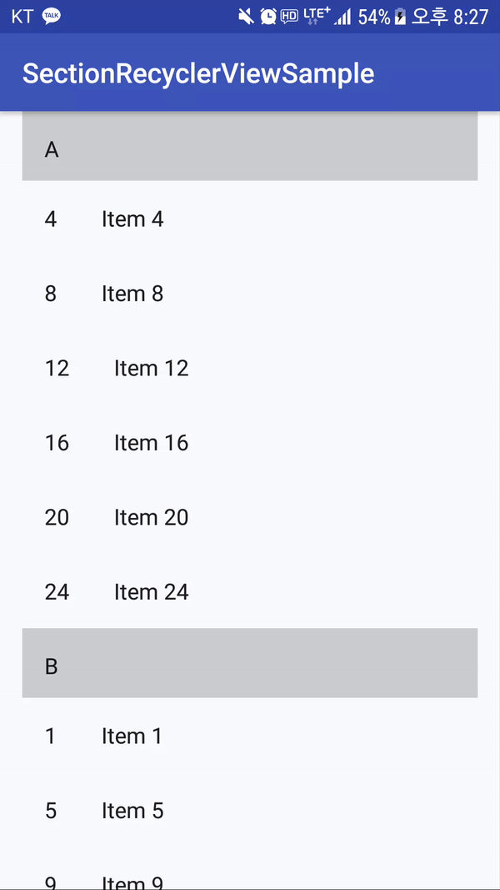

# SectionRecyclerViewSample

- Android SectionRecyclerView
- Use [SimpleArrayMap](https://developer.android.com/reference/android/support/v4/util/SimpleArrayMap.html)
 - Key : Header
 - Value : CommentList



#### Example

```java
public class MainActivity extends AppCompatActivity {

    @Override
    protected void onCreate(Bundle savedInstanceState) {
        super.onCreate(savedInstanceState);
        setContentView(R.layout.activity_main);

        RecyclerView recyclerView = (RecyclerView) findViewById(R.id.list);
        recyclerView.setLayoutManager(new LinearLayoutManager(this));
        recyclerView.setAdapter(new SectionRecyclerViewAdapter(DummyContent.ITEM_MAP));
    }
}

public class DummyContent {
    ...
    public static final SimpleArrayMap<String, List<DummyItem>> ITEM_MAP = new SimpleArrayMap<>();
    ...
    
}

```
